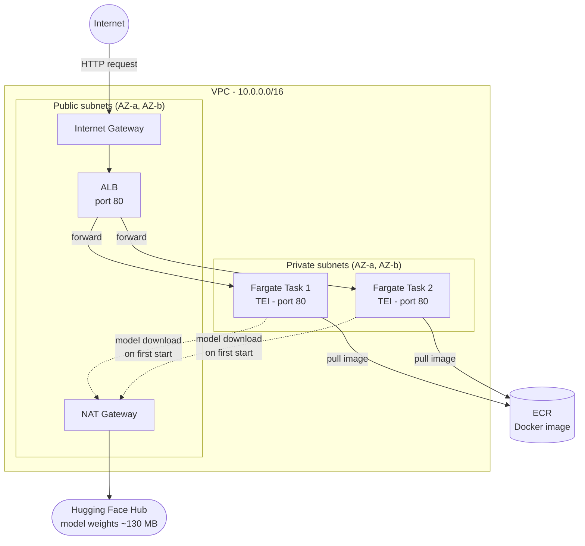

# Introduction

This lab introduces essential cloud computing concepts for MLOps, using Amazon Web Services (AWS). We will deploy a production-grade **text embedding service** - the same pattern used in real-world semantic search and RAG pipelines. By the end, you will have a scalable REST API running in private subnets behind a load balancer, with the container image stored in a private registry.

**What we are deploying:** [Text Embeddings Inference (TEI)](https://github.com/huggingface/text-embeddings-inference) by Hugging Face, running the [`BAAI/bge-small-en-v1.5`](https://huggingface.co/BAAI/bge-small-en-v1.5) model (~130 MB). TEI accepts text as input and returns dense vector representations (embeddings) you can use for semantic search, document clustering, or as input to a RAG pipeline.

### AWS services & tools
1. Identity and Access Management (IAM)
2. AWS CLI
3. Elastic Container Registry (ECR)
4. Virtual Private Cloud (VPC)
5. Elastic Container Service (ECS)
6. AWS Fargate
7. AWS CloudWatch

**If you are using your own account**, start from the beginning. Cost will be under $1 total if you complete the cleanup section the same day. We will set up billing monitoring and alerts. You will start by configuring security and permissions via IAM.

OR

> **If you are using AWS Academy Learner Lab** - skip sections 1.1, 1.2, and 1.4 entirely. **Go directly to section 1.3.** IAM configuration and billing are managed by AWS Academy and cannot be changed by students.

This lab uses the AWS Console and manual setup, to get a good feel for how AWS operates visually. You can interactively configure cloud services, experiment with architecture, and introduce infrastructure changes. In the next lab, we will use Infrastructure as Code (IaC) to implement modular and versioned configuration for the services used here.

> **Cost warning:** NAT Gateway and ALB together accrue ~$1.50/day even when idle. Complete section 7 (Cleanup) before leaving.

## Prerequisites
Before starting this lab, ensure you have:
- **Docker** installed and running locally - verify with `docker --version`
- **AWS CLI** installed - we will configure it in section 1.3
- No prior AWS experience is required - we start from scratch

## Architecture

The diagram below shows what we are building. Traffic enters from the internet, hits the Application Load Balancer in a public subnet, and is forwarded to Fargate containers running in private subnets. The NAT Gateway gives private containers outbound internet access, which is needed to pull the model weights from Hugging Face Hub on first startup.



---

## 1. Account setup & IAM configuration

When starting with a cloud, it is crucial to set up your AWS account properly for security and cost control. By default, you use the root account, which is not recommended due to its unrestricted access and auditing difficulties. Thus, we will start with securing access, creating an administrative IAM user, and implementing billing alerts. Identity and Access Management (IAM) is the core AWS service for authorization and authentication of users and services.

### Why do we need this?
1. **Least privilege principle** - you should always use the smallest set of permissions required for work.
2. **Security** - minimize attack surface, particularly in the case of compromised credentials.
3. **Auditing** - a root account is challenging to control, track, and audit. The root account has full access to all services, and its actions are hard to fully track and audit, clearly breaking the least privilege principle. In fact, AWS recommends removing all access keys for root accounts.

### 1.1 Enable Multi-Factor Authentication (MFA) for root account
1. Sign in to your root account and navigate to the Identity and Access Management (IAM) service.
2. At the top of the IAM dashboard, locate the security recommendations.
3. Set up MFA by downloading (or using your already-installed) authenticator app on your mobile device and following the on-screen instructions on the AWS IAM page.

### 1.2 Create an administrative IAM user
1. In the IAM Console, click **Create User** and choose `I want to create an IAM user`.
2. Specify the user details.
3. Create a new IAM group called **admin** and attach the policy `AdministratorAccess`.
4. Add the new user to the **admin** group.
5. Review the user groups and confirm that the user appears with the `AdministratorAccess` policy attached (via the admin group).
6. Before signing in with your new user, note the "Sign-in URL for IAM users in this account" on the Dashboard. Since this URL is complicated, customize it by creating an account alias.
7. Use another browser or an incognito window to navigate to the new URL and sign in using your new IAM user.

**Important:** Set up MFA for your administrator account as well.

**Note:** Do not lose or forget your root account credentials. Otherwise, you may need to contact AWS support.

### 1.3 Connect to AWS using the CLI
1. Install the AWS CLI by following the [AWS CLI installation guide](https://docs.aws.amazon.com/cli/latest/userguide/getting-started-install.html) and verify the installation with `aws --version`.
2. Configure credentials. The procedure depends on which account type you use:

   **If using a personal AWS account:**
   - In the IAM Console, select your new user and navigate to the **Security Credentials** tab.
   - Create a new access key and store it securely - treat it like a password and never commit it to git.
   - Run `aws configure` and enter the access key, secret key, and region.

   **If using AWS Academy Learner Lab:**
   - Navigate to **Courses** and select **AWS Academy Learner Lab** .
   - Go to **Modules**, then **AWS Academy Learner Lab**, then **Launch AWS Academy Learner Lab**.
   - Click **Start Lab** and wait for the status indicator to turn green.
   - Click **AWS Details**, then **AWS CLI** to reveal temporary credentials.
   - Copy the access key, secret key, **and session token** into `~/.aws/credentials` manually - `aws configure` does not ask for the session token.
   - Credentials expire when the session ends; refresh them at the start of each session.

3. Your `~/.aws/credentials` file should look like this:
```ini
[default]
aws_access_key_id     = YOUR_ACCESS_KEY
aws_secret_access_key = YOUR_SECRET_KEY
aws_session_token     = YOUR_SESSION_TOKEN   # AWS Academy only - omit for personal accounts
region                = YOUR_REGION          # e.g. eu-west-1 or us-east-1
```

4. Verify the CLI works:
```bash
aws sts get-caller-identity
```
You should see your account ID and user ARN printed back.

**Additional references:**
- [AWS CLI configuration basics](https://docs.aws.amazon.com/cli/latest/userguide/cli-configure-quickstart.html)
- [Root user best practices](https://docs.aws.amazon.com/IAM/latest/UserGuide/root-user-best-practices.html)
- [Root user tasks](https://docs.aws.amazon.com/IAM/latest/UserGuide/id_root-user.html#root-user-tasks)

### 1.4 Set up billing alerts
1. Navigate to the **Billing and Cost Management** dashboard from the AWS Management Console.
2. Activate access to billing data by navigating to **Billing Dashboard > Preferences**, check the box for "Receive Billing Alerts" and save the changes.
3. Set up a billing budget. Choose the "Cost budget" template, set a monthly limit (e.g. $5), and configure it to monitor actual costs.
4. Add an email notification by entering your email address to receive alerts when costs approach or exceed the budget.

**Additional references:**
- [Creating a cost budget](https://docs.aws.amazon.com/cost-management/latest/userguide/budgets-create.html)
- [What is cost management](https://docs.aws.amazon.com/cost-management/latest/userguide/what-is-costmanagement.html)

---

## 2. Elastic Container Registry (ECR)

ECR is a fully managed private Docker registry - think of it as Docker Hub, but hosted inside your AWS account and tightly integrated with IAM. Every time ECS launches a new Fargate task, it pulls your container image from ECR.

### Why do we need this?
1. **Privacy** - images are not publicly accessible. Only identities with the right IAM permissions can pull them.
2. **Reliability** - images stay inside your AWS region. No dependency on external registries going down or changing without notice.
3. **Security** - integrated with IAM for access control, supports KMS encryption, and includes built-in vulnerability scanning.

### What image are we using?

We will use the official **Text Embeddings Inference (TEI)** image published by Hugging Face on **GHCR** (GitHub Container Registry - GitHub's own Docker registry, an alternative to Docker Hub):

```
ghcr.io/huggingface/text-embeddings-inference:cpu-1.9.3
```

TEI is a production-grade HTTP server written in Rust that loads embedding models and serves them over a REST API. It is used internally by Hugging Face Inference Endpoints and is designed to run reliably at scale. We configure it to run `BAAI/bge-small-en-v1.5` - a compact English embedding model (33M parameters, ~130 MB) that ranks at the top of the [MTEB benchmark](https://huggingface.co/spaces/mteb/leaderboard) for its size class, published by the Beijing Academy of Artificial Intelligence.

Instead of building a Docker image ourselves, we will **mirror** the TEI image from GHCR into our private ECR repository. This is standard MLOps practice - you control which exact version runs in production, and you are not dependent on external registries staying up.

### 2.1 Create an ECR repository

> **Note:** Make sure all resources are created in the same region. If you are using **AWS Academy Learner Lab**, you must use **us-east-1** - it is the only supported region. If you are using a personal account, pick any region and stay consistent throughout the lab.

1. Navigate to **ECR > Repositories** in the AWS Console.
2. Click **Create repository**.
3. Name it `text-embeddings-inference`.
> **Note:** creating one repository per application is good practice - it keeps versions isolated and makes access control straightforward.
4. Enable **AES-256 encryption** (the default - no extra cost).
5. Leave other settings as default and create the repository.

### 2.2 Verify Docker is running

Before authenticating to ECR, make sure the Docker daemon is up:
```bash
docker info
```

If you see `Cannot connect to the Docker daemon` on Linux, start it:
```bash
sudo systemctl start docker
```

> **Note:** if you see `permission denied while trying to connect to the Docker daemon socket`, your user does not have permission to talk to the Docker daemon. By default, Docker only allows `root`. The fix is to add your user to the `docker` group - a system group that grants access to the Docker socket. Run this once, then all Docker commands work without `sudo`:
> ```bash
> sudo usermod -aG docker $USER
> newgrp docker
> ```
> `newgrp docker` applies the change immediately without logging out.

Verify:
```bash
docker run --rm hello-world
```
You should see a short success message.

### 2.3 Authenticate Docker to ECR

Before you can push or pull, your local Docker daemon needs to authenticate. Run the command below, replacing the placeholders with your actual region and account ID. You can also find this exact command in the ECR Console by clicking **View push commands** on your repository:


```bash
aws ecr get-login-password --region <region> | \
  docker login --username AWS --password-stdin \
  <aws_account_id>.dkr.ecr.<region>.amazonaws.com
```


### 2.3 Pull the TEI image and push it to ECR

1. Pull the image from GHCR:
```bash
docker pull ghcr.io/huggingface/text-embeddings-inference:cpu-1.9.3
```

2. Verify the image is available locally and copy the exact image ID or name for the next step:
```bash
docker images
```

3. Tag it with your ECR repository URI:
```bash
docker tag \
  ghcr.io/huggingface/text-embeddings-inference:cpu-1.9.3 \
  <aws_account_id>.dkr.ecr.<region>.amazonaws.com/text-embeddings-inference:latest
```

4. Push it to ECR:
```bash
docker push \
  <aws_account_id>.dkr.ecr.<region>.amazonaws.com/text-embeddings-inference:latest
```

5. In the ECR Console, open the repository and confirm the image appears with the `latest` tag and a recent push timestamp.

### 2.4 Test the image locally (optional but recommended)

Before deploying to Fargate, verify the container works on your machine:
```bash
docker run --rm -p 80:80 \
  -v $HOME/.cache/huggingface:/data \
  <aws_account_id>.dkr.ecr.<region>.amazonaws.com/text-embeddings-inference:cpu-1.9.3 \
  --model-id BAAI/bge-small-en-v1.5
```

> **Note:** the `-v` flag mounts a local cache directory so the model is not re-downloaded on every run.

Wait for the log line `Ready to serve requests`, then test it:
```bash
curl http://localhost/embed \
  -X POST \
  -H "Content-Type: application/json" \
  -d '{"inputs": "Machine learning infrastructure on AWS"}'
```

You should receive a JSON array of 384 floating-point numbers - the embedding vector for your input text.

**Additional references:**
- [Text Embeddings Inference - GitHub](https://github.com/huggingface/text-embeddings-inference)
- [BAAI/bge-small-en-v1.5 model card](https://huggingface.co/BAAI/bge-small-en-v1.5)
- [MTEB Leaderboard](https://huggingface.co/spaces/mteb/leaderboard)
- [Amazon ECR documentation](https://docs.aws.amazon.com/AmazonECR/latest/userguide/what-is-ecr.html)

---

## 3. Virtual Private Cloud (VPC)

A VPC is a logically isolated section of the AWS network that you fully control. Think of it as your own private data center network inside AWS - you define the IP address ranges, subnets, routing rules, and firewall policies. Without a custom VPC, all resources would share a flat default network with no isolation between services.

### Why do we need this?
1. **Isolation** - resources are isolated by default, ensuring only authorized traffic reaches them.
2. **Control** - customize IP ranges, subnets, route tables, and gateways.
3. **Scalability** - plan for future growth with proper IP planning and range management.
4. **Security** - place compute in private subnets, exposing only the load balancer publicly.

### Why private subnets for Fargate tasks?

Fargate tasks in **private subnets** are not directly reachable from the internet - there is no route from the outside into them. Traffic can only arrive via the ALB, which sits in a public subnet. The NAT Gateway lets containers reach outbound destinations (e.g. Hugging Face Hub to download model weights on startup) without being exposed inbound. This is the standard production pattern: **public subnet for ingress (ALB), private subnet for compute (Fargate)**.

### 3.1 Create a VPC
1. Go to the **VPC Console** in the AWS Management Console. A default VPC already exists, but we will create our own.
2. Click **Create VPC** and select **VPC only** - we will create subnets and other components manually in the next steps.
3. Configure the following:
   - **Name:** `embeddings-vpc`
   - **IPv4 CIDR block:** select **IPv4 CIDR manual input** and enter `10.0.0.0/16` - this gives you 65,536 IP addresses to distribute across subnets. Use [cidr.xyz](https://cidr.xyz) to explore how CIDR notation works.
   - Leave everything else as default.

**Additional references:**
- [What is Amazon VPC?](https://docs.aws.amazon.com/vpc/latest/userguide/what-is-amazon-vpc.html)
- [CIDR notation explained](https://aws.amazon.com/what-is/cidr/)

### 3.2 Create public and private subnets

Subnets divide your VPC into smaller segments with specific roles - public-facing or private backend. We will create **two public subnets and two private subnets** across multiple Availability Zones (AZs).

**Why two of each?** The Application Load Balancer requires at least two subnets in different AZs to operate. Spreading Fargate tasks across two AZs means one AZ failure does not bring down the service.

#### 3.2.1 Create public subnets
1. In the **VPC Console**, navigate to **Subnets** and click **Create subnet**.
2. Select **VPC:** `embeddings-vpc`.
3. Click **Add new subnet** to add both public subnets in one go and configure each:
   - **Subnet name:** `public-subnet-1` / `public-subnet-2`
   - **Availability Zone:** choose different AZs (e.g. `eu-west-1a` and `eu-west-1b`) for redundancy
   - **IPv4 CIDR Block:** `10.0.1.0/24` for `public-subnet-1` and `10.0.2.0/24` for `public-subnet-2`

#### 3.2.2 Create private subnets
1. Repeat the process - click **Create subnet**, select **VPC:** `embeddings-vpc`, and configure:
   - **Subnet name:** `private-subnet-1` / `private-subnet-2`
   - **Availability Zone:** same two AZs as the public subnets
   - **IPv4 CIDR Block:** `10.0.3.0/24` for `private-subnet-1` and `10.0.4.0/24` for `private-subnet-2`

**Additional references:**
- [Subnets for your VPC](https://docs.aws.amazon.com/vpc/latest/userguide/configure-subnets.html)
- [AWS Availability Zones](https://aws.amazon.com/about-aws/global-infrastructure/regions_az/)

### 3.3 Set up an Internet Gateway

An Internet Gateway (IGW) connects public subnets to the internet bidirectionally - resources in public subnets can receive inbound traffic and send outbound traffic.

1. Navigate to **VPC > Internet Gateways** and click **Create internet gateway**.
2. Name it `embeddings-igw`.
3. After creation, click **Actions > Attach to VPC** and attach it to `embeddings-vpc`.

**Additional references:**
- [Internet gateways](https://docs.aws.amazon.com/vpc/latest/userguide/VPC_Internet_Gateway.html)

### 3.4 Configure route tables

A route table is a set of rules that determines where network traffic from a subnet is directed. Each subnet must be associated with exactly one route table.

> **Common pitfall:** creating routes without associating them to subnets. If Fargate tasks stay in `PENDING` for more than 5 minutes, this is the first thing to check - private subnets must be associated with the private route table that has the NAT Gateway route.

#### 3.4.1 Create and configure a public route table
1. In the **VPC Console**, go to **Route Tables** and click **Create route table**.
2. Set **Name:** `public-route-table` and **VPC:** `embeddings-vpc`.
3. After creation, go to the **Subnet associations** tab and associate it with `public-subnet-1` and `public-subnet-2`.

   

3. Add a route to allow internet access:
   - **Destination:** `0.0.0.0/0`
   - **Target:** `embeddings-igw`

#### 3.4.2 Create and configure a private route table
1. Click **Create route table**, set **Name:** `private-route-table` and **VPC:** `embeddings-vpc`.
2. Go to the **Subnet associations** tab and associate it with `private-subnet-1` and `private-subnet-2`.
3. Leave routes empty for now - we will add the NAT Gateway route in the next section.

**Additional references:**
- [Configure route tables](https://docs.aws.amazon.com/vpc/latest/userguide/VPC_Route_Tables.html)

### 3.5 Set up a NAT Gateway

A NAT Gateway allows instances in private subnets to access the internet without exposing them to inbound traffic. In our case, this is essential - when a Fargate task starts, TEI downloads the `BAAI/bge-small-en-v1.5` model weights (~130 MB) from Hugging Face Hub. Without the NAT Gateway, the task cannot reach the internet and will fail to start.

> **Cost warning:** NAT Gateway costs approximately **$1/day** plus data processing fees. Delete it in section 7 (Cleanup) when you finish the lab.

1. In the **VPC Console**, navigate to **NAT Gateways** and click **Create NAT gateway**.
2. Configure the following:
   - **Name:** `embeddings-nat`
   - **Availability mode:** `Zonal` - this allows selecting a specific subnet
   - **Subnet:** `public-subnet-1` - the NAT Gateway must live in a public subnet
   - **Connectivity type:** `Public`
3. Click **Allocate Elastic IP** to assign a stable public IP address to the NAT Gateway.

   

4. Leave other settings as default and click **Create NAT gateway**.
5. After creation, go back to `private-route-table`, open the **Routes** tab and click **Edit routes**. Add:
   - **Destination:** `0.0.0.0/0`
   - **Target:** NAT Gateway - select `embeddings-nat`

**Additional references:**
- [NAT gateways](https://docs.aws.amazon.com/vpc/latest/userguide/vpc-nat-gateway.html)

### 3.6 Create Security Groups

Security groups are stateful firewalls that operate at the resource level. **Stateful** means that when an inbound rule allows a connection, the return traffic is automatically allowed - you do not need a separate outbound rule for responses.

We need two Security Groups. Navigate to **VPC Console > Security Groups > Create security group** and for each one select **VPC:** `embeddings-vpc`.

**`embeddings-alb-sg`** (for the load balancer)
- **Inbound:** Allow TCP traffic on port `80` from anywhere (`0.0.0.0/0`)
- **Outbound:** Default - allow all outbound traffic

**`embeddings-tasks-sg`** (for Fargate tasks)
- **Inbound:** Allow TCP traffic on port `80` from `embeddings-alb-sg` only - not from the internet
- **Outbound:** Default - allow all outbound traffic

Restricting inbound to the ALB security group means your containers are only reachable through the load balancer, never directly.

**Additional references:**
- [Security groups for your VPC](https://docs.aws.amazon.com/vpc/latest/userguide/vpc-security-groups.html)

### 3.7 Set up an Application Load Balancer (ALB)

The ALB is the public entry point to your service. It listens on port 80, accepts requests from the internet, and distributes them across healthy Fargate tasks. It also runs health checks - periodically polling each task on the `/health` endpoint, and stopping traffic to any task that fails to respond.

#### 3.7.1 Create a Target Group

The Target Group is the list of backends the ALB routes to. ECS will automatically register and deregister Fargate tasks as they start and stop.

1. In the **EC2 Console**, navigate to **Load Balancing > Target Groups** in the left sidebar and click **Create target group**.

> **Note:** You may see a "VPC Lattice Target Groups" page instead - that is a different service. Make sure you are under **EC2 > Load Balancing > Target Groups**, not VPC Lattice.
2. Configure the following:
   - **Target type:** `IP addresses` - required for Fargate, which assigns tasks IP addresses rather than instance IDs
   - **Name:** `embeddings-target-group`
   - **Protocol / Port:** `HTTP` / `80`
   - **VPC:** `embeddings-vpc`
   - **Health check path:** `/health` - TEI exposes this endpoint natively and returns HTTP 200 when the model is loaded and ready to serve
   - **Target registration:** leave empty - ECS registers tasks automatically

#### 3.7.2 Create the ALB
1. In the **EC2 Console**, navigate to **Load Balancers** and click **Create load balancer > Application Load Balancer**.
2. Configure the following:
   - **Name:** `embeddings-alb`
   - **Scheme:** `Internet-facing` - we need to call the service from outside the VPC
   - **IP address type:** `IPv4`
3. Under **Network mapping**:
   - **VPC:** `embeddings-vpc`
   - **Availability Zones and subnets:** select both AZs and pick the corresponding **public** subnet in each (`embeddings-public-subnet-1` and `embeddings-public-subnet-2`)
   - **IP pools:** leave as default (no Elastic IP assignment needed)
4. Under **Security groups:** select `embeddings-alb-sg` (remove the default security group if pre-selected)
5. Add a listener:
   - **Protocol / Port:** `HTTP` / `80`
   - **Default action:** select `Forward to target groups`, then choose `embeddings-target-group`

**Additional references:**
- [Application Load Balancers](https://docs.aws.amazon.com/elasticloadbalancing/latest/application/introduction.html)
- [Target groups for ALB](https://docs.aws.amazon.com/elasticloadbalancing/latest/application/load-balancer-target-groups.html)

---

## 4. ECS & Fargate deployment

**AWS Fargate** is a serverless compute engine that runs containers without requiring you to manage underlying EC2 instances. It automatically scales up and down based on demand - well suited for MLOps, where we scale horizontally since model inference saturates a single CPU core.

**AWS ECS** (Elastic Container Service) is a fully managed container orchestration service. You define *what* to run and *how many*, and ECS handles scheduling, placement, and lifecycle management.

**Together:** ECS decides what to run and when, while Fargate supplies the compute resources. You pay only for the vCPU and memory your tasks use, billed per second.

### Key ECS concepts

- **Task Definition** - a blueprint describing how to run a container: image, CPU, memory, environment variables, IAM role, port mappings, and log configuration.
- **Task** - a running instance of a Task Definition. One task = one running container (or group of containers).
- **Service** - a controller that keeps a desired number of Tasks running at all times. If a task crashes, the Service replaces it. It also integrates with the load balancer, registering tasks as targets when they start.

### Why use AWS Fargate?
1. **Serverless** - no need to provision or manage EC2 instances or clusters.
2. **Simplified management** - AWS handles patching, scaling, and infrastructure maintenance.
3. **Cost efficiency** - you pay per second of actual task runtime, not for idle server capacity.

### 4.1 Create an ECS Cluster

A cluster is a logical grouping of tasks and services. With Fargate, it is mainly an organizational boundary - there are no servers to configure.

1. Navigate to the **ECS Console** and click **Create cluster**.
2. **Cluster Name:** `embeddings-cluster`.
3. Leave other settings as default and create the cluster.

### 4.2 Create a Task Definition

1. In the **ECS Console**, navigate to **Task Definitions** and click **Create new task definition**.
2. Select **Fargate** as the launch type.
3. Configure the following:
   - **Task Definition Name:** `embeddings-task`
   - **Operating System:** `Linux/X86_64`
   - **CPU:** `1 vCPU`
   - **Memory:** `3 GB` - TEI with model weights needs ~1.5 GB; this leaves headroom for the OS and request handling
   - **Task Role** and **Task Execution Role:**
     - **AWS Academy Learner Lab:** use `labrole` for both
     - **Personal AWS account:** create `ecsTaskExecutionRole` with the managed policy `AmazonECSTaskExecutionRolePolicy` attached - this grants ECS permission to pull images from ECR and write logs to CloudWatch
4. Under **Container definitions**, click **Add container** and configure:
   - **Container name:** `tei`
   - **Image URI:** your ECR image - `<account_id>.dkr.ecr.<region>.amazonaws.com/text-embeddings-inference:latest`
   - **Port mappings:** container port `80`, protocol `TCP`
   - **Command:** expand the **Docker configuration** section and find the **Command** field. Enter `--model-id,BAAI/bge-small-en-v1.5` (comma-separated, no spaces - ECS splits on commas and passes each part as a separate argument)
   - **Environment variables:**
     > **Note:** TEI downloads the model from Hugging Face Hub (~130 MB) on first start. This is why the NAT Gateway is required - without it, the task cannot reach the internet and will fail to start.
   - **Log configuration:** use `awslogs` (the default). ECS will stream all container output to CloudWatch Logs automatically.
5. Leave other settings as default and create the task definition.

### 4.3 Create a Service

An ECS Service ensures your application runs continuously and scales automatically. If a task crashes, the Service replaces it. It also registers and deregisters tasks as load balancer targets as they start and stop.

1. In the **ECS Console**, open `embeddings-cluster` and click **Create** under the **Services** tab.
2. Under **Service details**:
   - **Family:** `embeddings-task`
   - **Revision:** latest
   - **Service name:** `embeddings-service`
3. Under **Environment**:
   - Change **Compute options** from `Capacity provider strategy` to **`Launch type`**
   - **Launch type:** `Fargate`
4. Under **Deployment configuration**:
   - **Desired tasks:** `2` - one per Availability Zone for high availability
5. Under **Networking**:
   - **VPC:** `embeddings-vpc`
   - **Subnets:** select both **private** subnets (`embeddings-private-subnet-1`, `embeddings-private-subnet-2`). Remove any public subnets if pre-selected.
   - **Security groups:** remove the default security group and add `embeddings-tasks-sg`
6. Under **Load balancing**:
   - **Load balancer type:** `Application Load Balancer`
   - Switch from **Create new** to **Use an existing load balancer**
   - **Load balancer:** `embeddings-alb`
   - **Listener:** select the existing HTTP:80 listener
   - **Target group:** `embeddings-target-group`
7. Leave other settings as default and create the service.

### 4.4 Monitor startup

After creating the service, startup takes a few minutes. Do not proceed until both tasks are fully running.

1. In the **ECS Console**, open `embeddings-cluster` and go to the **Services** tab. Click `embeddings-service` and watch the **Running tasks** counter - wait until it shows **2/2**.
2. For more detail, open the **Tasks** tab. Each task goes through: `PROVISIONING > PENDING > RUNNING`. This is normal - do not refresh or recreate the service.
3. Each task downloads the model on first start (~130 MB via the NAT Gateway). The task reaches `RUNNING` state before the model finishes loading, so wait an additional 2-3 minutes after both tasks show `RUNNING` before testing the endpoint.
4. You can also confirm readiness in **EC2 > Target Groups > embeddings-target-group > Targets** - both targets should show status **Healthy**.
5. If tasks remain in `PENDING` or move to `STOPPED` after 10 minutes, check the **Events** tab. Common causes:
   - `CannotPullContainerError` - private subnet missing the NAT Gateway route, or ECR permissions missing from the execution role
   - `Task failed ELB health checks` - wrong health check path, container still loading the model, or wrong port in the security group
   - `ResourceInitializationError` - task execution role missing `AmazonECSTaskExecutionRolePolicy`
   - Tasks keep restarting - not enough memory, try increasing to 4 GB

### 4.5 Access the service

1. Navigate to **EC2 > Load Balancers**, find `embeddings-alb`, and copy the **DNS name**.
2. Verify the service is up:
```bash
curl http://<alb-dns-name>/embed \
  -X POST \
  -H "Content-Type: application/json" \
  -d '{"inputs": "Hello world"}'
```
Expected response: a JSON array of 384 floats - the embedding vector for the input text.

**Additional references:**
- [Amazon ECS documentation](https://docs.aws.amazon.com/AmazonECS/latest/developerguide/Welcome.html)
- [AWS Fargate](https://aws.amazon.com/fargate/)
- [ECS task definitions](https://docs.aws.amazon.com/AmazonECS/latest/developerguide/task_definitions.html)

---

## 5. Testing the embedding service

The service is now live. From the outside, it is just a REST API - let us verify it works end-to-end and explore what it actually produces.

### 5.1 Generate an embedding
```bash
curl http://<alb-dns-name>/embed \
  -X POST \
  -H "Content-Type: application/json" \
  -d '{"inputs": "deploying machine learning models on AWS"}'
```
Expected: a JSON array of 384 floats - the embedding vector for the input text. Each number represents a dimension in the model's learned semantic space.

### 5.2 Batch embedding

TEI supports batching multiple texts in a single request, which is more efficient than calling the API in a loop:
```bash
curl http://<alb-dns-name>/embed \
  -X POST \
  -H "Content-Type: application/json" \
  -d '{"inputs": ["first sentence", "second sentence", "third sentence"]}'
```
Expected: a 2D array - one embedding vector of length 384 per input text.

### 5.3 Write a Python test script

Write a script that tests the service and demonstrates what embeddings are useful for:
1. Send at least two texts to `/embed` and assert each response contains a vector of length 384.
3. Compute cosine similarity between semantically similar and semantically different sentence pairs, and confirm that similar sentences score higher.

```python
import requests
import numpy as np

ALB_URL = "http://<alb-dns-name>"

def cosine_similarity(a, b):
    a, b = np.array(a), np.array(b)
    return float(np.dot(a, b) / (np.linalg.norm(a) * np.linalg.norm(b)))

response = requests.post(f"{ALB_URL}/embed", json={
    "inputs": [
        "machine learning model deployment",
        "deploying AI models to production",
        "how to bake a chocolate cake"
    ]
})

vectors = response.json()
print("Similar pair similarity:    ", cosine_similarity(vectors[0], vectors[1]))
print("Dissimilar pair similarity: ", cosine_similarity(vectors[0], vectors[2]))
```

Similar sentences should score above `0.8`. The dissimilar pair should score below `0.5`. This is the foundation of semantic search - instead of matching keywords, you measure vector distance.

### 5.4 Explore the API documentation

TEI exposes an OpenAPI spec at:
```
http://<alb-dns-name>/docs
```
This shows all available endpoints, including `/embed`, `/tokenize`, and `/metrics`.

**Additional references:**
- [TEI API reference](https://huggingface.github.io/text-embeddings-inference/)
- [BAAI/bge-small-en-v1.5 model card](https://huggingface.co/BAAI/bge-small-en-v1.5)
- [Sentence embeddings and semantic search](https://www.sbert.net/examples/applications/semantic-search/README.html)

---

## 6. Monitoring with CloudWatch

AWS CloudWatch is the native observability platform for AWS. ECS Fargate automatically sends container logs and infrastructure metrics to CloudWatch without any additional configuration when you use the default `awslogs` log driver.

### 6.1 View container logs

Every line the TEI process writes to stdout is captured and streamed to CloudWatch Logs in real time.

1. Navigate to **CloudWatch > Log groups**.
2. Find the log group for your task definition - typically `/ecs/embeddings-task`.
3. Open a log stream. You will see TEI startup messages, the model download progress, and one log entry per HTTP request received.

### 6.2 View ECS metrics

1. Navigate to **CloudWatch > Metrics > ECS**.
2. Browse per-service metrics: `CPUUtilization` and `MemoryUtilization`.
3. During model download on startup, you will see a brief spike in both. After that, utilization levels off until requests arrive.

### 6.3 Set up a CloudWatch alarm (optional)

A CloudWatch alarm watches a metric and sends a notification when it crosses a threshold. This is the starting point for production alerting in MLOps.

1. In **CloudWatch > Alarms**, click **Create alarm**.
2. Select the `MemoryUtilization` metric for `embeddings-service`.
3. Set the threshold to 80% and add an email notification via SNS.

**Additional references:**
- [CloudWatch Logs](https://docs.aws.amazon.com/AmazonCloudWatch/latest/logs/WhatIsCloudWatchLogs.html)
- [ECS CloudWatch metrics](https://docs.aws.amazon.com/AmazonECS/latest/developerguide/cloudwatch-metrics.html)
- [CloudWatch alarms](https://docs.aws.amazon.com/AmazonCloudWatch/latest/monitoring/AlarmThatSendsEmail.html)

---

## 7. Lab submission

As homework, you are expected to complete this entire lab. Submit the following:

**Screenshots or a short screen recording showing:**
1. IAM admin user with `AdministratorAccess` policy *(personal accounts only)*
2. ECR repository with the pushed `latest` image and a recent push timestamp
3. VPC Console showing `embeddings-vpc` with 4 subnets, IGW, and NAT Gateway
4. Route tables with correct associations and routes
5. Target Group showing 2 healthy targets
6. ECS cluster with 2 tasks in `RUNNING` state
7. Terminal output of your Python test script with similarity scores printed

> **Complete the cleanup section below before the end of the day.** Do not skip it - running resources cost money even when idle.

---

## 8. Cleanup

> **Complete this section the same day you finish the lab.** NAT Gateway, ALB, and Elastic IP accrue charges even when no requests are coming in.

Delete resources in the order below - AWS blocks deletion of resources that other resources still depend on:

1. ECS > Clusters > `embeddings-cluster` > Services > `embeddings-service` > Delete > check **Force delete service**
2. ECS > Clusters > `embeddings-cluster` > Delete
3. EC2 > Load Balancers > `embeddings-alb` > Delete
4. EC2 > Target Groups > `embeddings-target-group` > Delete
5. VPC > NAT Gateways > `embeddings-nat` > Delete, wait until status is `deleted`
6. EC2 > Elastic IP addresses > select the EIP > Actions > Release
7. VPC > Your VPCs > `embeddings-vpc` > Delete (removes IGW, subnets, route tables, security groups automatically)
8. ECR > Repositories > `text-embeddings-inference` > Delete all images, then delete the repository


**Code:**
- Your Python test script from section 5.3

**Proof of cleanup:**
- Screenshot of the empty ECS cluster, or the Billing Dashboard showing $0 for ECS, EC2, and VPC.
